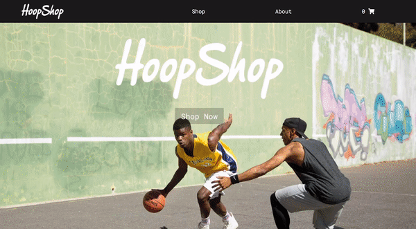

# HoopShop

<a href="https://kfig21.github.io/shopping_cart/" target="_blank" rel="noopener noreferrer">View the project here!</a> 👀

<h3>Summary</h3>

HoopShop is a mock storefront page that was made for React section of the The Odin Project javascript curriculum. The goal of this project was to learn how to use BrowserRouter, Routes, Link, & Switch in React by creating a storefront that has multiple pages for you to navigate while maintaing the state of the app.

<h3>Demo GIF</h3>

<h3>Features:</h3>

- Adding/removing items to the cart
- Cart dynamically updates thanks to React hooks
- Filter products by type or brand
- Responsive design

<h3>Image credits:</h3>

Product images - Eastbay.com

Home slider images: 
Ludwig Favre - www.ludwigfavre.com/portfolio_page/new-york-basketball-courts/  
Julian Love - www.JulianLove.com/Personal/Basketball  
Craig Augustine - www.CraigAusgustinePhoto.com  
Kim Fetrow - www.shootproof.com/blog/basketball-photography-tips/  
